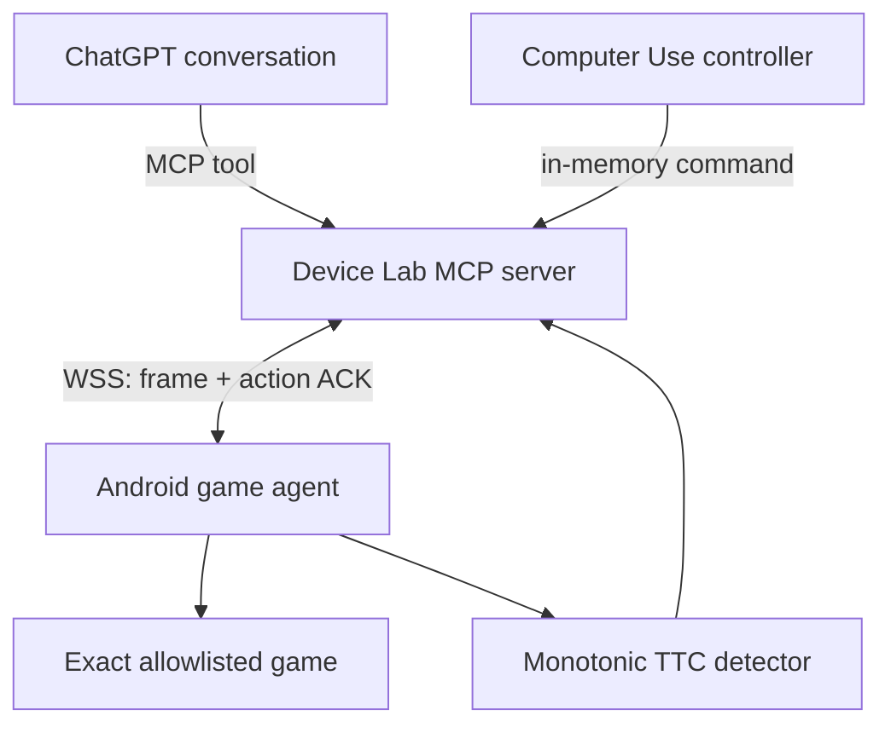

# Architecture

## Why v2 cannot produce real TTC

The previous APK committed every command, state update, and frame through GitHub
Contents API branches. One action required GitHub write propagation, a roughly
one-second device poll, gesture execution, another commit, and another read. That
architecture adds seconds per observation/action cycle, has no stable frame/action
coordinate transform, and cannot timestamp the actual level transition.
All of those relay branches, state files, and snapshot workflows are removed from
v3.

## v3 control path

The Android app initiates the connection. No inbound listener, GitHub polling, or
API key is required on the phone. ChatGPT can attach to the MCP server through
Developer mode; a private deployment can use Secure MCP Tunnel.

ChatGPT is the session orchestrator: it selects the device/game, observes, arms
TTC, and starts or stops play. The high-frequency observation/action loop runs on
the relay after one `start_autoplay` tool call. This avoids treating a ChatGPT tool
round trip as a tap clock. Platform API credentials for that loop are separate
from the ChatGPT account and stay on the relay.

## Latency budget

| Segment | Target |
| --- | ---: |
| frame capture and JPEG encode | 35–90 ms |
| phone ↔ nearby relay WebSocket | 10–80 ms |
| action dispatch to Android | 15–60 ms |
| on-device level timestamp error | at most two detector frames |
| model decision | measured separately, never folded into device clock |

Each action acknowledgement exposes phone queue delay, device execution time, and
server round-trip time so the lab can distinguish gameplay TTC from controller or
network latency.

The autonomous controller can return multiple Computer Use actions in one turn.
They are executed as one device batch, avoiding a model round trip per tap.

## TTC semantics

The source of truth is `SystemClock.elapsedRealtimeNanos()` on the Android device.
Wall-clock timestamps are metadata only.

For `stage_change` mode:

1. OCR or accessibility text extracts a stage identifier with a game profile regex.
2. The identifier must be identical in two consecutive analyzed frames.
3. The first stable frame for stage N starts its timer.
4. The first stable frame for stage N+1 ends N and starts N+1.
5. The report stores start/end frame IDs, monotonic nanoseconds, TTC milliseconds,
   action count, detector mode, stability-frame count, and OCR interval.

Every arm/start operation creates a `ttcSessionId`. The relay keeps a bounded,
in-memory sequence of all level reports for that session, including across a
device reconnect. It stores no frames beyond the latest JPEG.

The research recorder also appends non-image events to a local JSONL journal:
commands, acknowledgements, queue/device/round-trip latency, TTC reports, device
state, and autoplay lifecycle. `get_research_data` filters by device, game, action
session, or TTC session and returns JSON or CSV. Secrets are recursively redacted.

Games without readable stage text can use `text_end` or explicit start/end
markers. Explicit markers are less accurate and are reported as such.

Each game gets a small detector profile rather than a new APK. Portrait/landscape
changes resize the existing capture surface, and frame-space commands are rejected
if display geometry changed after observation.

## Security boundary

- The user enters exact game package names locally on the phone. Remote commands
  cannot add packages to that allowlist.
- Gestures are rejected unless the current foreground package is exactly allowed.
- System UI, Settings, Play Store, installers, authenticators, wallets, billing,
  and permission controllers are always denied.
- The APK asks for screen capture and accessibility, but not contacts, SMS,
  clipboard, location, shell, or unrestricted storage.
- A permanent foreground notification exposes STOP.
- The server authenticates the device enrollment token and caps batches, duration,
  coordinates, and command deadlines.
- Frames remain in memory by default. Recording is opt-in and must have a retention
  policy appropriate for the research environment.

## Account and API boundary

ChatGPT account authorization and OpenAI Platform API keys are separate. The same
ChatGPT account can call the MCP tools in Developer mode. Optional autonomous play
uses an OpenAI API key stored only on the relay host. The API key is never sent to
the Android app.
